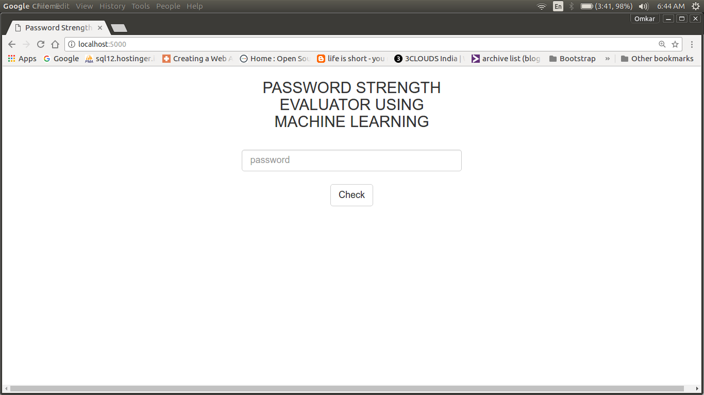
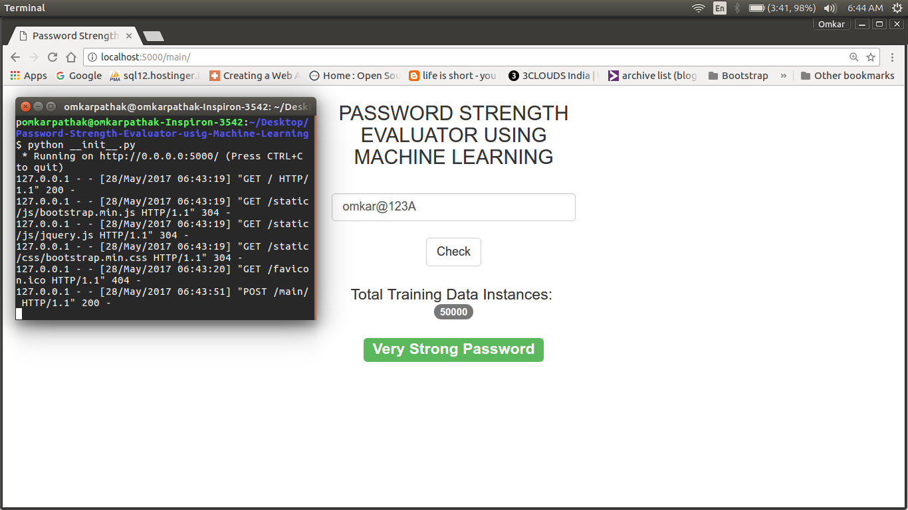

# Password-Strength-Evaluator-using-Machine-Learning
My TE Seminar mini project

* This is my third year mini project.
* Flask (Python web development framework) used for webpages.
* SVM (Support Vector Machines) used for training and classification purposes.
* Self-generated data set of upto 50000 instances

Steps:
1. First make sure you have flask installed, if not enter the following command in terminal:
' pip install Flask '.
2. Next, you need 'scikit-learn', which is a data mining tool in Python. Install it by typing:
' pip install -U scikit-learn'. 
3. After installing flask, extract the contents in a folder and then run the '__init__.py' file.
4.  Server runs at ' localhost:5000 ', type this address in the browser and see the SVM in action.

